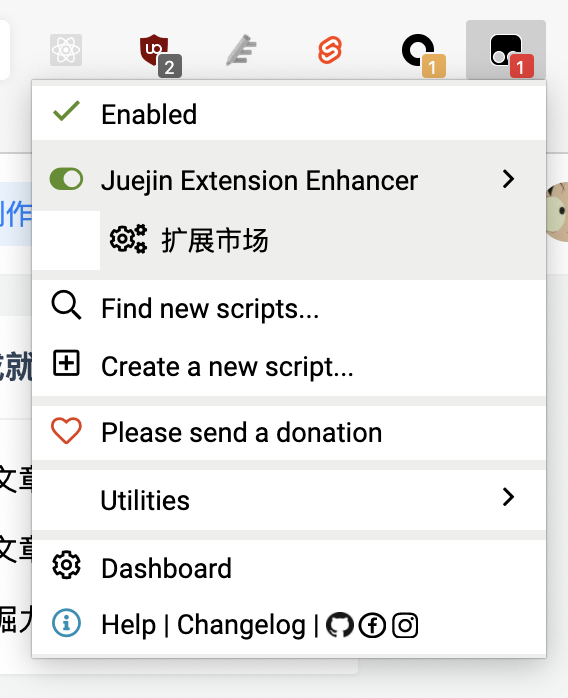
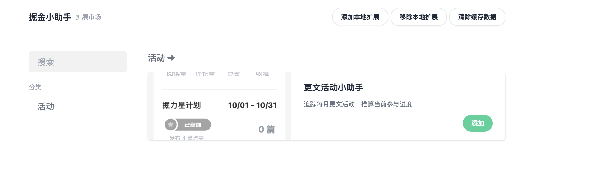

# 掘金扩展助手

提供一个扩展平台，聚合掘金社区的各类第三方扩展，可插拔使用。

扩展旨在为掘金社区提供辅助支持，如活动进度追踪、数据统计增强、快捷操作辅助等等。

## 如何使用

1. 安装脚本

2. 访问扩展市场
   

3. 添加需要的扩展

4. 刷新掘金页面

## 常见问题

### 无法访问扩展市场

目前扩展市场和自动更新部署在 Vercel 上，部分地区可能会有访问问题，如访问不到，可通过 [站长工具](http://tool.chinaz.com/speedtest/juejin-enhancer-extensions.vercel.app) 看下当前的测速情况。

如果频繁遇到网络问题，请提交 [飞书问卷](https://wenjuan.feishu.cn/m?t=sJ1T3Ldvufxi-iye3)，以便开发者进行统计，设计更优方案。

### 如何进行反馈

可通过以下进行反馈方式

- [掘金文章](https://juejin.cn/post/7026913066228465695) 下评论留言
- 前往 [GitHub](https://github.com/curly210102/juejin-enhancer-userscript) 提交 issue
- 微信联系开发者 Juan_mao_mao

## 版本更新

### 1.0.0

- 扩展平台上线运行
- 预装「掘金更文小助手」，跟进 11 月的更文活动
